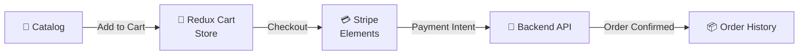

# React E-Commerce Boilerplate

<p align="center">
  
  
  
  
  
</p>

A feature-rich **React e-commerce boilerplate** with product catalog, shopping cart, checkout flow with Stripe, and user authentication. Ready to plug in your own backend.

---

## 🛍️ Features

- 🏪 Product catalog with search & category filters
- 🛒 Cart with quantity management (Redux Toolkit)
- 💳 Checkout with Stripe Elements
- 🔐 JWT authentication (login/register)
- 📦 Order history
- 📱 Fully responsive (Tailwind CSS)

---

## 🏗️ State & Flow



---

## 🚀 Quick Start

```bash
npm install
cp .env.example .env      # add VITE_STRIPE_PUBLIC_KEY
npm run dev
```

---

## 📁 Structure

```
src/
├── components/
│   ├── ProductCard/
│   ├── Cart/
│   └── Checkout/
├── features/
│   ├── cart/cartSlice.ts
│   ├── auth/authSlice.ts
│   └── orders/ordersSlice.ts
├── pages/
│   ├── Home.tsx
│   ├── Product.tsx
│   ├── Checkout.tsx
│   └── Orders.tsx
└── services/
    └── api.ts
```

---

## ⚙️ Environment Variables

```env
VITE_API_URL=http://localhost:5000
VITE_STRIPE_PUBLIC_KEY=pk_test_...
```

---

## 📄 License

MIT
